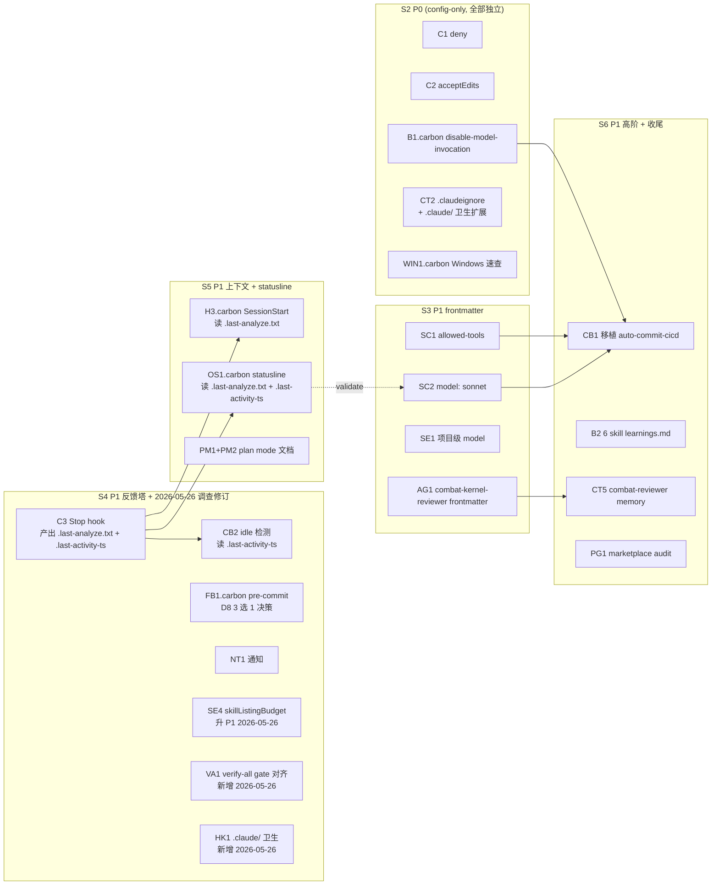

# Carbon Harness Implementation Plan — 对照 harmony 19 项反推

> 计划日期：2026-05-25（2026-05-26 调查修订）
> 适用仓库：`D:/carbon-shade-web`（本仓库）
> 源参照：`D:/windsulf/daugf2527-repos/harmonyos-libretro-emulator/docs/plans/2026-05-24-harness-fusion-design.md`（两仓库共享设计文档）
> harmony 已落地状态：S2 (P0) + S4 (12/12 P1) = 19 项 closed（commit `0bb99ce` / `fb2c6a4` / `c0d18bc` / `9944fbb`）
> 本计划状态：S1 完成（本文件）；S2-S6 待实施；S4.5 作废（2026-05-26）
> 实施 cwd：必须 `cd D:/carbon-shade-web`（任何步骤切错 cwd 会让 hook 误指向 harmony）
>
> **⚠️ S 编号说明**：本文 §9 的 S2-S6 是 **carbon 内部编号**；`docs/plans/2026-05-24-harness-fusion-design.md` §6 的 S2-S6 是 **双仓库共享编号**，二者不同（fusion §6 S3 = carbon plan §9 S2）。跨文档对话或回查 commit 时按本文 §9 编号走。

---

## 1. Business goal + Success criteria

### Business goal

把 harmony 项目 19 项已落地 harness 改造按 carbon-shade-web 的技术栈（TypeScript / Vite / Phaser / Node）等价实现，让 carbon 同样具备：
1. **"改完代码 → 1 命令拿信号"反馈回路**（carbon 已有 `npm run analyze` + `verify-all` skill，只差状态持久化 + statusline 显示 + SessionStart 注入闭环）
2. **会话级反思沉淀**（user-level `session-debrief` skill 已自动享受，只差 idle 自动触发器）
3. **副作用 skill 安全包装**（disable-model-invocation / allowed-tools / model pin）
4. **桌面通知 + 项目级状态栏**（NT1 / OS1）
5. **本地 + CI 反馈塔补 ② 层**（pre-commit hook）

### Success criteria

1. 本计划独立可执行——下次 cwd=carbon 的会话照表走完，不需要本次会话 context。
2. 每条迁移项指明 **harmony 对照 file:line** + **carbon 等价路径** + **验收口径**。
3. 优先级分 P0 / P1 / P2，**P0 必须能在 1 次 2h 会话内落完**。
4. 明确"harmony 业务特定不该抄"的反模式（同样地，carbon 业务特定的 guard-phaser-boundary / guard-velocity-writes 不反推回 harmony）。

### Out-of-scope（本计划明确不做）

- 不改 carbon 业务代码（src/combat/、src/data/、tools/dnf-extract/）。
- 不动 `~/.claude/`（全局），只动 carbon 项目级。
- 不改 carbon 已有且正常工作的 6 个 skill + 4 个 PreToolUse guard 内部逻辑——只在 frontmatter 加新字段。
- 不引入 husky/lefthook（HarmonyOS 那边用裸 `.git/hooks/pre-commit` 是因为非 Node 项目；carbon 是 Node 项目本可以用 husky，但**本计划仍走裸 `.git/hooks/pre-commit`**——理由：harness-fusion 第 6 节 P2/不做明确否决"lefthook 迁移 husky"，个人项目尺度差异不显著，避免新增 npm devDep）。
- 不向 harmony 反向移植 carbon 业务专属物（dnf-physics-extraction skill / guard-phaser-boundary）。

### 关键约束

- 个人项目，无团队回路（参考 harmony memory `feedback_individual_project_workflow`）。
- 当前实施时**绝对不要**在 cwd=harmony 时改 carbon——参考 harmony memory `feedback_agent_worktree_isolation`。
- carbon 项目语言：CLAUDE.md 中英混合，本计划用中文；新加的 hook 脚本用 Node `.mjs`（与现有 4 个 guard 一致），不引入 bash 风格。

---

## 2. carbon 现状对账（19 项 harmony 落地 → carbon 状态）

> 来源：harmony commit `0bb99ce`（T1-T6 30 findings 修复）+ `fb2c6a4`（S4 NT1/OS1 收尾）+ `c0d18bc`（H3/SE1）+ `9944fbb`（B2/SA1）+ `8441462`（附录 O wire-up）

| # | harmony ID | harmony 落地 | carbon 现状 | 行动 |
|---|---|---|---|---|
| 1 | H1 PreToolUse 守卫 | 3 guard | ✓ 4 guard（含业务） | **不做**（carbon 已超 harmony） |
| 2 | H2 closed-loop skill | 移植 carbon | ✓ 源头 | **不做** |
| 3 | B1 disable-model-invocation | auto-commit-cicd | ✗ closed-loop + audit 都没设 | **B1.carbon — P0** |
| 4 | C1 permissions.deny | harmony 已有 4 条 | ✗ 完全空 | **C1 — P0** |
| 5 | C2 defaultMode: acceptEdits | harmony 已有 | ✗ 缺 | **C2 — P0** |
| 6 | CT1 CLAUDE.md ≤200 行 | root 102 行（已分层） | ✓ 实测 **194 行**（< 200 上限） | ~~**CT1**~~ **作废**（2026-05-26 调查：plan 350 行估算偏高 156 行；联动 CT3 @import 也作废） |
| 7 | CT2 .claudeignore | harmony 已有 | ✗ MISSING + 有 `.claude/phase4-4b-research-report.md` 游离 / `scheduled_tasks.lock` | **CT2 — P0**（范围扩，与 HK1 配套） |
| 8 | CT3 @import 子 CLAUDE.md | `@entry/.../ets/CLAUDE.md` + `cpp/CLAUDE.md` | ✗ 没分层，自然不需要 | ~~**CT3**~~ **作废**（CT1 不拆，CT3 自然无意义） |
| 9 | CT5 subagent memory | `napi-boundary-reviewer.memory.md` | ✗ 缺 | **CT5 — P1** |
| 10 | B2 learnings.md | 2 个 skill 各一份 | ✗ 6 个 skill 全无 | **B2 — P1** |
| 11 | H3 SessionStart context-inject | git status + log + 上次 quick_signals | ⚠ 有 reset-status.mjs 但只写 status.json 不 echo 给 Claude | **H3.carbon — P1（改造 reset-status）** |
| 12 | C3 Stop hook | hygiene + regression + idle 时间戳 | ✗ 完全空 | **C3 — P1** |
| 13 | SA1 commit message CHECKPOINT | auto-commit-cicd Step3→4 间 | ✓ closed-loop CHECKPOINT D 已有 | **不做** |
| 14 | SE1 项目级 model | `"model": "sonnet"` | ✗ 缺 | **SE1 — P1** |
| 15 | OS1 项目级 statusLine | bash 解析 quick_signals + idle | ⚠ 有 status.json 但 settings.json 无 statusLine 字段 | **OS1.carbon — P1** |
| 16 | NT1 Notification hook | BurntToast / msg fallback | ✗ 缺 | **NT1.carbon — P1** |
| 17 | PG1 plugin marketplace audit | 决策不装 | ✗ 没 audit 过 | **PG1.carbon — P1** |
| 18 | FB1 pre-commit hook | `.git/hooks/pre-commit` 跑 quick_signals | ⚠ 已有 `scripts/hooks/pre-push` 跑 `npm run analyze`；pre-commit 层 MISSING | **FB1.carbon — P1 改写**（基于 pre-push 现状 3 选 1） |
| 19 | SC1+SC2 skill frontmatter | allowed-tools + model: sonnet | ✗ 6 个 skill 全无 | **SC1+SC2 — P1** |

**额外（harmony 没列但 carbon 该有的）**:

| # | 内容 | harmony 对照 | carbon 现状 | 行动 |
|---|---|---|---|---|
| 20 | auto-commit-cicd 等价 | harmony `.claude/skills/auto-commit-cicd/SKILL.md`（commit→push→PR→CI→merge + 自愈 ≤3） | ✗ 缺（closed-loop 止于 git commit） | **CB1 — P1 移植** |
| 21 | idle 自动检测触发 session-debrief | `scripts/check/session_idle_detector.sh` + UserPromptSubmit hook | ⚠ reset-status.mjs 已占 UserPromptSubmit 位 → 合并 | **CB2 — P1** |
| 22 | AG1 combat-kernel-reviewer frontmatter | harmony napi-reviewer line 3 "NOT for general C++ review" | ✗ agent 文件无 frontmatter（纯 markdown） | **AG1 — P1** |
| 23 | PM1+PM2 plan mode 指引 + Alt+M | harmony root CLAUDE.md W6 速查表 | ✗ 完全缺 | **PM1+PM2 — P1** |
| 24 | WIN1.carbon Windows 速查表 | harmony root CLAUDE.md "Windows 注意事项速查" | ✗ 完全缺 | **WIN1.carbon — P0** |

**总计**: P0 = 5 项 / P1 = 14 项（CT1 / CT3 作废 -2；SE4 升 P1 / VA1 / HK1 新增 +3；FB1 改写）

> **修订说明（2026-05-26 Explore agent 实地摸底）**：5 处 plan 与实情不一致已修订：
> 1. CLAUDE.md 实测 194 行（plan 估 350）→ **CT1 + CT3 作废**
> 2. closed-loop SKILL.md **13587 字节占 6 skill 总和 40%**（合计 33543 字节）→ **SE4 从 P2 升 P1**
> 3. `scripts/hooks/pre-push` 已存在 → **FB1.carbon 改写**为 3 选 1
> 4. verify-all skill 3 gate ≠ npm run analyze 8 gate → **新增 VA1**
> 5. `.claude/phase4-4b-research-report.md` 游离 / `scheduled_tasks.lock` → **新增 HK1 + CT2 范围扩**

---

## 3. P0 实施清单（必须 1 次会话 ≤2h 落完）

### C1 — 抄 permissions.deny

- **harmony 对照**: `.claude/settings.json:22-28`
- **carbon 落地**: `D:/carbon-shade-web/.claude/settings.json` 在 `permissions` 段加 `deny`：
  ```json
  "deny": [
    "Bash(rm -rf*)",
    "Bash(curl*)",
    "Bash(* | bash*)",
    "Read(**.env)",
    "Read(**secrets**)"
  ]
  ```
- **验收**: 会话内尝试 `Bash(rm -rf foo)` 被拒，提示与 harmony 一致。

### C2 — 加 defaultMode: acceptEdits

- **harmony 对照**: `.claude/settings.json:2`
- **carbon 落地**: settings.json `permissions` 内加 `"defaultMode": "acceptEdits"`（**注：2026-05-26 S2 实测 schema 要求在 `permissions.defaultMode` 而非顶层**，plan v3 原写顶层会被 schema 拒）
- **验收**: cwd=carbon 时新会话默认进 acceptEdits 模式，Edit/Write 不再弹窗。

### B1.carbon — 副作用 skill 加 disable-model-invocation

- **harmony 对照**: `.claude/skills/auto-commit-cicd/SKILL.md` frontmatter `disable-model-invocation: true`
- **carbon 落地**（2 个文件）:
  - `.claude/skills/closed-loop/SKILL.md` frontmatter 加 `disable-model-invocation: true`
  - `.claude/skills/audit/SKILL.md` frontmatter 加 `disable-model-invocation: true`
- **验收**: prompt "跑闭环" / "audit X"，skill 不自动触发；只有显式 `/closed-loop` / `/audit` 才触发。

### CT2 — 新建 .claudeignore（含 .claude/ 卫生扩展）

- **harmony 对照**: `D:/windsulf/.../harmonyos-libretro-emulator/.claudeignore`（包含 `deprecated/legacy/` 等）
- **carbon 落地**: `D:/carbon-shade-web/.claudeignore` 新建：
  ```
  # Build outputs / generated
  dist/
  node_modules/
  .tmp/
  verification/
  bash.exe.stackdump

  # Test artifacts
  playwright-report/
  test-results/

  # Personal AI tooling
  .codex/
  .codex_tmp/
  .windsurf/

  # .claude/ runtime residue (2026-05-26 调查新增；与 HK1 配套)
  .claude/scheduled_tasks.lock
  .claude/.last-*-ts
  .claude/.last-*.txt
  .claude/worktrees/
  ```
- **验收**:
  1. carbon 会话内 Grep `dist/` 不再扫到（除非显式 `--no-claudeignore`）
  2. Grep `.claude/scheduled_tasks` 不再扫到
- **配套**: 游离文件 `.claude/phase4-4b-research-report.md` 不在此 ignore 范围内（单点文件移走更合理）→ 见 §4 新增 HK1 块
- **.gitignore 豁免配套（2026-05-26 S2 实测踩坑）**: 原 `.gitignore` 第 15 行 `.claude/*` 通配会忽略 `settings.json`，commit 时会丢；需加 `!.claude/settings.json` 豁免。当前 `.gitignore` 已 / 应包含 4 条豁免：
  ```
  .claude/*
  !.claude/settings.json    # ← S2 实施时新增
  !.claude/skills/
  !.claude/agents/
  !.claude/hooks/
  .claude/settings.local.json
  ```

### WIN1.carbon — CLAUDE.md 加 Windows 注意事项速查表

- **harmony 对照**: root CLAUDE.md "Windows 注意事项速查"段（W1-W10 表）
- **carbon 落地**: `D:/carbon-shade-web/CLAUDE.md` 末尾或 "Environment" 段（如有）后新增段：
  ```markdown
  ## Windows 注意事项速查

  | # | 坑 | 一句话应对 |
  |---|---|---|
  | W1 | `cmd /c` 包装 stdio MCP | MCP JSON `"command":"cmd","args":["/c","npx","-y","<pkg>"]` |
  | W2 | Git Bash 不在 PATH 时 Claude Code 起不来 | `CLAUDE_CODE_GIT_BASH_PATH=C:\Program Files\Git\bin\bash.exe` |
  | W3 | PowerShell `claude` not recognized | 加 `$env:USERPROFILE\.local\bin` 到 User PATH |
  | W4 | `%USERPROFILE%` vs `~` | PowerShell + Git Bash 用 `~`；CMD 用 `%USERPROFILE%` |
  | W5 | PowerShell 中文 / emoji 乱码 | `chcp 65001; [Console]::OutputEncoding=[Text.Encoding]::UTF8` |
  | W6 | Plan mode Shift+Tab 某些终端 skip | 改按 **Alt+M** 进入 plan mode |
  | W7 | MCP server OAuth 后启动超时 | 启动前 `$env:MCP_TIMEOUT=10000` |
  | W9 | 不知 Claude Code 健康状态 | `/doctor` 或 `claude doctor` |
  ```
- **验收**: `grep -E "W[1-9]" CLAUDE.md | wc -l` ≥ 8。

**P0 实施顺序建议**（每条 ≤20 min）:
1. C1（最快，settings.json 加 5 行）
2. C2（最快，settings.json 加 1 行）
3. B1.carbon（两个 SKILL.md frontmatter 各加 1 行）
4. CT2（新建 .claudeignore）
5. WIN1.carbon（CLAUDE.md 加 1 段表格）

P0 全部完成后 `git add -A && git commit -m "chore(harness): S2 — P0 5 项落地 (C1/C2/B1/CT2/WIN1)"`。

---

## 4. P1 实施清单（分 3-4 次会话，2-4 周窗口）

### S3 会话（≈2h）— "副作用 skill 标准化" 主题

#### SC1 — 副作用 skill 加 allowed-tools

- **harmony 对照**: `.claude/skills/auto-commit-cicd/SKILL.md:5` `allowed-tools: Bash, Read, Grep, Glob, Edit, Write`
- **carbon 落地**: 5 个副作用 skill frontmatter 各加 `allowed-tools`:
  - `closed-loop/SKILL.md`: `Bash, Read, Grep, Glob, Edit, Write, Agent, TaskCreate, TaskUpdate, TaskList, TaskGet`
  - `audit/SKILL.md`: `Bash, Read, Grep, Glob, Agent`（audit 不写代码，去 Edit/Write）
  - `add-action/SKILL.md`: `Read, Grep, Glob, Edit, Write`
  - `dnf-physics-extraction/SKILL.md`: `Bash, Read, Grep, Glob, Edit, Write`
  - `gen-test/SKILL.md`: `Read, Grep, Glob, Write`
  - `verify-all/SKILL.md`: `Bash`（只跑 npm 脚本）
- **验收**: 跑 `/audit X` 时即使 Claude 想 `Edit foo.ts` 也被拒。

#### SC2 — 副作用 skill 加 model: sonnet

- **harmony 对照**: `auto-commit-cicd/SKILL.md:6` `model: sonnet`
- **carbon 落地**: 同 SC1 的 6 个 SKILL.md frontmatter 各加 `model: sonnet`
- **验收**: 触发 `/closed-loop` 时 statusline 显示 sonnet（前提：OS1 完成）。

#### SE1 — settings.json 加项目级 model

- **harmony 对照**: `.claude/settings.json:3` `"model": "sonnet"`
- **carbon 落地**: `.claude/settings.json` 顶层加 `"model": "sonnet"`
- **风险**: 字段在某些版本 Claude Code 可能不识别。**实施前先 `claude doctor` 验证当前版本支持**；如不支持，降级为各 SKILL/agent frontmatter 显式声明（SC2 已覆盖）。

#### AG1 — combat-kernel-reviewer 加 frontmatter

- **harmony 对照**: `napi-boundary-reviewer.md:1-6`:
  ```yaml
  ---
  name: napi-boundary-reviewer
  description: Review NAPI boundary changes in entry/src/main/cpp/app/napi/. Use when files in that directory ... NOT for general C++ review.
  tools: Read, Grep, Glob, Bash
  model: sonnet
  ---
  ```
- **carbon 落地**: `D:/carbon-shade-web/.claude/agents/combat-kernel-reviewer.md` 顶部加 frontmatter:
  ```yaml
  ---
  name: combat-kernel-reviewer
  description: Review changes under src/combat/ for kernel purity and determinism. Use when files in src/combat/ are added, modified, or refactored — focuses on Phaser-isolation, replay determinism, frame-data provenance, hit/damage/status invariants. NOT for src/game/ or src/data/ general TypeScript review.
  tools: Read, Grep, Glob, Bash
  model: sonnet
  ---
  ```
- **验收**: 在 cwd=carbon 时让 Claude "审一下 src/combat/HitResolver2D5.ts"，Claude 自动派 combat-kernel-reviewer agent（不需要用户显式指定）。

**S3 commit message**: `chore(harness): S3 — P1 frontmatter 标准化 (SC1/SC2/SE1/AG1)`

---

### S4 会话（≈2h）— "反馈塔补齐" 主题

#### C3 — Stop hook

- **harmony 对照**: `.claude/stop-hook.sh`（跑 hygiene + regression + idle 时间戳）
- **carbon 落地**: 新建 `.claude/stop-hook.sh`（或 `.mjs`，按 carbon 现有 hook 风格用 .mjs）:
  ```javascript
  // .claude/stop-hook.mjs
  import { execSync } from 'node:child_process';
  import { writeFileSync, mkdirSync } from 'node:fs';
  try {
    execSync('npm run analyze', { stdio: 'inherit', cwd: process.cwd() });
  } catch (e) {
    console.error('[stop-hook] analyze failed, see above');
    process.exit(0); // 不阻塞 stop
  }
  // 盖 idle 时间戳给 UserPromptSubmit 算 gap
  mkdirSync('.claude', { recursive: true });
  writeFileSync('.claude/.last-activity-ts', String(Math.floor(Date.now() / 1000)));
  ```
- **settings.json 追加**:
  ```json
  "Stop": [{ "hooks": [{ "type": "command", "command": "node .claude/stop-hook.mjs" }] }]
  ```
- **验收**: Claude stop 时自动跑 `npm run analyze` + `.claude/.last-activity-ts` 文件被更新。

#### CB2 — idle 自动检测合并到 reset-status.mjs

- **harmony 对照**: `scripts/check/session_idle_detector.sh check` + `.claude/hooks/check-idle-on-prompt.sh`
- **carbon 落地**: 改造 `.claude/hooks/reset-status.mjs`（已绑 UserPromptSubmit），在原逻辑基础上加 idle 检测段:
  ```javascript
  // 加在文件末尾
  import { existsSync, readFileSync } from 'node:fs';
  const tsPath = '.claude/.last-activity-ts';
  const threshold = parseInt(process.env.CLAUDE_DEBRIEF_IDLE_MIN || '15', 10) * 60;
  if (existsSync(tsPath)) {
    const last = parseInt(readFileSync(tsPath, 'utf8').trim(), 10);
    if (Number.isInteger(last)) {
      const gap = Math.floor(Date.now() / 1000) - last;
      if (gap > threshold) {
        console.log(`[auto-detected idle: previous Claude response ended ${Math.floor(gap/60)} min ago. Consider running /session-debrief to capture lessons before context fades.]`);
      }
    }
  }
  // 总是更新时间戳
  import { writeFileSync, mkdirSync } from 'node:fs';
  mkdirSync('.claude', { recursive: true });
  writeFileSync(tsPath, String(Math.floor(Date.now() / 1000)));
  ```
- **验收**: 模拟 16 分钟 idle (`echo $(($(date +%s) - 1000)) > .claude/.last-activity-ts`)，下一次 UserPromptSubmit 产出 `[auto-detected idle:]` sentinel，触发用户级 session-debrief skill 主动询问。

#### FB1.carbon — pre-commit hook（基于 pre-push 现状改写）

- **harmony 对照**: `.git/hooks/pre-commit`（裸 git hook，跑 `bash scripts/check/quick_signals.sh`）
- **carbon 现状**（2026-05-26 调查）: 已存在 `scripts/hooks/pre-push` 跑 `npm run analyze`（8 gate 阻塞 push）—— pre-commit 层 MISSING
- **3 选 1 决策**（**决策 A — 2026-05-26 S2 后拍板**）:
  - **A. 补 pre-commit 快速门 ✅ 拍板**: 新建 `.git/hooks/pre-commit` 跑 `npm run typecheck && npm run static:test`（~30s，不跑 build），承担"快速验证"；pre-push 继续跑全 8 gate analyze。两层并存：pre-commit 阻 typo/类型错，pre-push 阻深度 gate。
  - ~~B. 仅扩 pre-push~~: 不补 pre-commit，让 pre-push 已有的 8 gate analyze 兜底；接受"commit 不验，push 才验"现状。理由：DNF Stage 1 期间 commit 量大且多为草稿，每次 commit 跑 lint 打扰。
  - ~~C. 不补~~: 完全靠 PostToolUse hook + Claude 主动 verify-all 兜底。
- **若选 A，落地脚本**:
  ```bash
  #!/usr/bin/env bash
  # carbon pre-commit — fast type/static gate only. Full analyze runs on pre-push.
  # Bypass with: git commit --no-verify (use sparingly).
  npm run typecheck && npm run static:test
  ```
- **若选 A，setup**: `scripts/setup-git-hooks.mjs` 一键 symlink（同 pre-push 现有 setup 模式）
- **验收**:
  - 若 A: `git commit` 时 typecheck 失败拒提；`git commit --no-verify` 可跳过；pre-push 8 gate 仍生效
  - 若 B: 本段加注 "决策 B：仅扩 pre-push，不补 pre-commit"
  - 若 C: 本段加注 "决策 C：不补，靠 PostToolUse 兜底"

#### NT1.carbon — Notification hook

- **harmony 对照**: `.claude/hooks/notify.sh`（BurntToast → msg fallback）
- **carbon 落地**: 新建 `.claude/hooks/notify.mjs`:
  ```javascript
  import { execSync } from 'node:child_process';
  let input = '';
  process.stdin.on('data', c => input += c);
  process.stdin.on('end', () => {
    let msg = 'Claude Code event';
    const m = input.match(/"message"\s*:\s*"([^"]*)"/);
    if (m) msg = m[1].slice(0, 100).replace(/'/g, '');
    try {
      const hasBurnt = execSync('powershell.exe -NoProfile -Command "Get-Module -ListAvailable BurntToast"', { encoding: 'utf8' });
      if (hasBurnt.includes('BurntToast')) {
        execSync(`powershell.exe -NoProfile -Command "New-BurntToastNotification -Text 'Claude Code', '${msg}'"`, { stdio: 'ignore' });
      } else {
        execSync(`msg "%USERNAME%" "Claude Code: ${msg}"`, { stdio: 'ignore' });
      }
    } catch { /* swallow */ }
  });
  ```
- **settings.json 追加**:
  ```json
  "Notification": [{ "hooks": [{ "type": "command", "command": "node .claude/hooks/notify.mjs" }] }]
  ```
- **前置条件**: 用户一次性 `powershell -Command "Install-Module BurntToast -Scope CurrentUser -Force"`（与 harmony 一样不自动装）。
- **验收**: 让 Claude 跑 `npm run build`（数十秒），结束时桌面右下角弹通知。

#### SE4 — Skill listing budget 调参（2026-05-26 升 P1）

- **来源**: Explore agent 量化：6 个 SKILL.md 合计 33543 字节，closed-loop 单文件 **13587 字节 = 40% 占比**；Claude Code 默认 `skillListingBudgetFraction: 0.01`（1%）即将撞顶；微信公众号「克劳德猎手」一文给出诊断 + 调参方案
- **carbon 落地**（注：写到 user-level `~/.claude/settings.json`，不写项目级，因为 budget 影响所有 skill 含 user 级 + 跨项目通用）:
  ```json
  {
    "skillListingBudgetFraction": 0.02,
    "skillListingMaxDescChars": 200
  }
  ```
- **前置条件**: Claude Code 版本 ≥ v2.1.129（实施前 `claude doctor` 确认）
- **D7 决策点**: 若 `claude doctor` 报字段不识别 → 跳过 SE4 调参，转走 SC6（SKILL.md frontmatter `paths:`）路径作用域兜底（见 §13.3 D7）
- **验收**:
  1. `/context` 显示 skill listing budget 不再有 dropped warning
  2. 在 carbon 项目内输入"跑闭环 X"，`/closed-loop` 仍能被列出（描述未被砍）
  3. `/doctor` 输出 skill 总数与 `ls ~/.claude/skills + ls .claude/skills` 总数一致

#### VA1 — verify-all skill 与 npm run analyze 语义对齐（2026-05-26 新增）

- **来源**: Explore agent 发现 `verify-all/SKILL.md` 跑 3 gate（typecheck / static:test / build），但 `npm run analyze` 是 8 gate（多 depcruise / event-trace / pipeline-dump / manifest-consumers / knip）。Claude 可能误信"verify-all 通过 = CI 通过"
- **carbon 落地**（2 选 1）:
  - **A. 扩 verify-all 跑全 8 gate**: 改 SKILL.md 让命令变成 `npm run analyze`（与 CI 一致）；缺点：含 build 跑时间从 ~30s 涨到 ~60-90s，"快速验证"语义破坏
  - **B. 显式标"快速预检 ≠ CI"**（推荐）: SKILL.md frontmatter `description` 改成 "Quick 3-gate pre-check (typecheck/static:test/build). Does NOT cover the 8-gate analyze used by CI" + 内容里加一行 "若需 CI 等价，跑 `npm run analyze` 而非 /verify-all"
- **验收**: `/verify-all` 触发时输出明示"3 gate 快速预检，CI 等价要跑 analyze"
- **风险**: 选 A 时 verify-all 跑时间显著拉长，日常打扰增加；选 B 时依赖 Claude 看 description（可能仍误信）

#### HK1 — .claude/ 目录卫生（2026-05-26 新增）

- **来源**: Explore agent 发现 `.claude/phase4-4b-research-report.md` 游离（疑似会话临时产物遗留）+ `.claude/scheduled_tasks.lock` 运行时锁文件未在 .gitignore
- **carbon 落地**:
  1. 移走或归档 `.claude/phase4-4b-research-report.md` → `docs/research/2026-05-XX-phase4-4b-jump-velocity.md`（按内容主题归位 docs/research/）
  2. `.gitignore` 加 `.claude/scheduled_tasks.lock` + `.claude/.last-*-ts` + `.claude/.last-*.txt` + `.claude/worktrees/`（与 CT2 .claudeignore 协同）
  3. 加 Stop hook 末段检查 `.claude/` 根目录是否有 `*.md` 文件不属于 skills/agents/，警告但不阻塞
- **验收**:
  1. `ls .claude/*.md` 仅 settings 类（如有）+ 不应有研究文档
  2. `git status` 不再把 `.claude/scheduled_tasks.lock` 列为 untracked

**S4 commit message**: `chore(harness): S4 — P1 反馈塔 + 调查修订 (C3/CB2/FB1/NT1/SE4/VA1/HK1)`

---

### S5 会话（≈2h）— "上下文 + 状态可视化" 主题

#### H3.carbon — SessionStart 上下文注入（改造 reset-status）

- **harmony 对照**: `.claude/hooks/session-start.sh`（echo git status + log -3 + 上次 quick_signals 摘要）
- **carbon 落地**: 改造 `.claude/hooks/reset-status.mjs`（已绑 SessionStart），在原"重置 status.json"逻辑后追加 echo:
  ```javascript
  // 在 reset-status.mjs 末尾添加
  import { execSync } from 'node:child_process';
  import { existsSync, readFileSync } from 'node:fs';
  try {
    console.log('=== git status -s ===');
    console.log(execSync('git status -s', { encoding: 'utf8' }).slice(0, 2000));
    console.log('\n=== git log --oneline -3 ===');
    console.log(execSync('git log --oneline -3', { encoding: 'utf8' }));
    if (existsSync('.claude/.last-analyze.txt')) {
      console.log('\n=== last analyze ===');
      console.log(readFileSync('.claude/.last-analyze.txt', 'utf8'));
    }
  } catch { /* silent */ }
  ```
- **stop-hook.mjs 同步**: C3 里的 `npm run analyze` 输出末尾摘要到 `.claude/.last-analyze.txt`（写入用 `tee`-like 重定向）。
- **验收**: 重启 Claude Code、cwd=carbon、新会话开场 prompt "现状如何？"，Claude 立刻知道当前分支 / 最近 3 commit / 上次 analyze 状态，不需要新增 Bash 调用。

#### OS1.carbon — 项目级 statusLine

- **harmony 对照**: `.claude/statusline.sh`（pure bash，输出 `[branch*] qs:PASS idle:Nm`）
- **carbon 落地**: 新建 `.claude/statusline.mjs`（Node 风格，复用现有 status.json）:
  ```javascript
  #!/usr/bin/env node
  import { existsSync, readFileSync } from 'node:fs';
  import { execSync } from 'node:child_process';
  let input = ''; for await (const c of process.stdin) input += c;
  let cwd = process.cwd();
  const m = input.match(/"(?:current_dir|cwd)"\s*:\s*"([^"]*)"/);
  if (m) cwd = m[1];
  try { process.chdir(cwd); } catch {}
  let branch = '?';
  try { branch = execSync('git branch --show-current', { encoding: 'utf8' }).trim() || '?'; } catch {}
  let dirty = '';
  try { if (execSync('git status --porcelain', { encoding: 'utf8' }).trim()) dirty = '*'; } catch {}
  let analyze = '?';
  if (existsSync('.claude/.last-analyze.txt')) {
    const t = readFileSync('.claude/.last-analyze.txt', 'utf8');
    if (/ALL PASS|✓|GREEN/.test(t)) analyze = 'PASS';
    else if (/FAIL|✗|RED/.test(t)) analyze = 'FAIL';
  }
  // 复用 status.json 的 task progress 字段（carbon 独有）
  let task = '';
  if (existsSync('.claude/status.json')) {
    try {
      const s = JSON.parse(readFileSync('.claude/status.json', 'utf8'));
      if (s.task) task = ` ${s.task}`;
    } catch {}
  }
  let idle = '';
  if (existsSync('.claude/.last-activity-ts')) {
    const last = parseInt(readFileSync('.claude/.last-activity-ts', 'utf8'), 10);
    if (Number.isInteger(last)) {
      const gap = Math.floor(Date.now() / 1000) - last;
      if (gap > 60) idle = ` idle:${Math.floor(gap/60)}m`;
    }
  }
  console.log(`[${branch}${dirty}] az:${analyze}${task}${idle}`);
  ```
- **settings.json 追加**:
  ```json
  "statusLine": { "type": "command", "command": "node .claude/statusline.mjs" }
  ```
- **验收**: 状态栏显示 `[main*] az:PASS <task> idle:5m`。

#### PM1+PM2 — CLAUDE.md 加 plan mode 指引 + Alt+M 注记

- **harmony 对照**: root CLAUDE.md W6 速查表 + harness-fusion 附录 F
- **carbon 落地**: `D:/carbon-shade-web/CLAUDE.md` 加段 "When to use plan mode":
  ```markdown
  ## When to use plan mode

  复杂任务**先 /plan**，触发条件：
  - 跨 ≥3 文件改动 / schema 变更 / src/combat/ 内核改动 / replay 哈希影响
  - 重构、重命名跨模块导出
  - security-sensitive（npm scripts / Phaser asset 加载链）

  不需要 /plan：单文件修复 / typo / 单个 frame data 条目调整。

  **Windows 用户**：Shift+Tab 在部分终端 skip plan mode，改用 **Alt+M**（与 WIN1 速查表 W6 一致）。
  ```
- **验收**: `grep -E "plan mode|/plan|Alt\+M" CLAUDE.md | wc -l` ≥ 3。

**S5 commit message**: `chore(harness): S5 — P1 上下文注入 + statusline + plan mode (H3/OS1/PM1/PM2)`

---

### S6 会话（≈1.5h）— "高阶移植 + 收尾" 主题

#### CB1 — 移植 auto-commit-cicd skill

- **harmony 对照**: `D:/windsulf/.../harmonyos-libretro-emulator/.claude/skills/auto-commit-cicd/SKILL.md`
- **carbon 落地**: 新建 `D:/carbon-shade-web/.claude/skills/auto-commit-cicd/SKILL.md`，按 carbon 技术栈适配：
  - frontmatter: `disable-model-invocation: true` + `allowed-tools: Bash(git*), Bash(gh*), Bash(npm run*), Read, Grep, Glob, Edit, Write` + `model: sonnet`
  - Step 2 本地预检改为 `npm run typecheck && npm run static:test`（不跑 build/smoke，太慢）
  - Step 5 监控 CI 改用 carbon 的 GitHub workflow 名（待查 `.github/workflows/` 找出主 CI workflow 名）
  - Step 7 自愈循环常见错误指引按 TS / Phaser / Vite 错误模式重写
- **同目录加** `learnings.md`（B2 一并落）
- **验收**: 用户敲 `/auto-commit-cicd`，skill 走完 commit → push → PR → CI → merge 全流程。

#### B2.carbon — 6 个 skill 各加 learnings.md

- **harmony 对照**: `closed-loop/learnings.md` + `auto-commit-cicd/learnings.md`（append-only 模板）
- **carbon 落地**: 给 closed-loop / audit / verify-all / add-action / dnf-physics-extraction / gen-test 6 个 skill 同目录各加 `learnings.md`（初始模板 + 表头）。
- **CB1 也加一份**（共 7 份 learnings.md）。
- **验收**: 用户级 `session-debrief` 跑完，5 个问题的答案中"哪个 skill 该触发但没触发 / 哪个 skill 验证有效"两条直接 Append 到对应 `learnings.md`。

#### CT5 — combat-kernel-reviewer 加 subagent memory

- **harmony 对照**: `.claude/agents/napi-boundary-reviewer.memory.md`（v2.1.33+ 自动加载）
- **carbon 落地**: 新建 `.claude/agents/combat-kernel-reviewer.memory.md`，内容：
  - Phaser-isolation invariants（src/combat/ 不准 import phaser）
  - Replay determinism patterns（6-int snapshot, hash parity gate）
  - Common mistakes from past reviews（如 velocity 写入路径违规、frame data 缺 sourceProvenance）
  - Patterns to flag in diffs（动态 import / RNG 未 seed / Date.now() 直读）
- **验收**: 让 Claude 派 combat-kernel-reviewer 审一个 src/combat/ 文件，agent 引用 memory.md 中的 invariants。

#### PG1.carbon — plugin marketplace audit

- **harmony 对照**: harness-fusion 附录 J PG1 决策"全部不装，继续自维护"
- **carbon 落地**: 跑 `/plugin marketplace browse` 或 `gh api repos/anthropics/claude-plugins-official/contents/` 查 35 个 internal plugin，列出可能替代 carbon 自维护件的：
  - `commit-commands` plugin vs CB1 移植的 auto-commit-cicd
  - `code-review` plugin vs combat-kernel-reviewer
  - `session-report` plugin vs user-level session-debrief
  - `hookify` / `skill-creator` 通用工具
- **决策记录**：写到本文件 PG1 段下"Status 2026-MM-DD: ..."（参考 harness-fusion-design.md PG1 status 行）
- **验收**: 计划文档多 1 段 audit 结论 + 决策（装 / 不装 / 部分用）。

**S6 commit message**: `chore(harness): S6 — P1 收尾 (CB1/B2/CT5/PG1)`

---

### ~~S4.5（可选）— CT1 评估会话~~ **作废（2026-05-26）**

#### ~~CT1 — 评估 CLAUDE.md 350 行是否需要拆分~~

> **作废理由**: 2026-05-26 Explore agent 实地摸底，carbon root `CLAUDE.md` 实测 **194 行**（plan 350 行估算偏高 156 行），低于 harness-fusion 推荐 ≤200 行的上限。无需拆分。联动 **CT3 @import 子 CLAUDE.md** 也作废（无子文件可 @import）。
>
> **若未来 CLAUDE.md 扩张超 200 行**：重启 CT1 评估走原决策树（按模块边界拆 `src/combat/CLAUDE.md` / `src/data/CLAUDE.md`）。原决策树内容保留作未来参考：
> - 350 行 < ≤200 行的 1.75 倍 → 边界值
> - 若内容已含明确模块边界 → 拆 + CT3 @import 一并落
> - 若全是顶层项目身份 + 全局约束 → 不拆

---

## 5. P2 探索（条件触发后再做）

| ID | 内容 | 触发条件 |
|---|---|---|
| SE2 | settings.json `additionalDirectories` 加 Phaser 类型源 / DNF 数据真值目录 | Claude 频繁 Read 跨项目目录失败时 |
| SC3 | skill frontmatter `argument-hint` | skill 用户提示不够清晰时 |
| SC4/SC5 | skill 体内嵌 `!cmd` / `@file` 现代化 | 当前手工写"运行 X"足够时不做 |
| WT2 | subagent `isolation: worktree` v2.1.72+ 评估 | Claude Code 升级到 v2.1.72+ 后跑一次验证 |
| OS2 | builtin "detailed" + showCost/showTokens 替代自定义 statusline.mjs | 自维护 statusline 出 bug 时 |
| NT2 | CLAUDE.md 加注 Claude 何时主动调 PushNotification | NT1 hook 稳定 1-2 周后 |
| WIN3 | `/doctor` 嵌入 Stop hook | 长会话出现 Claude Code 健康问题时 |
| CB3 | 完全 headless API 分析 transcript 自动 debrief | session-debrief 手动跑 1 个月稳定后 |

---

## 6. 明确不做（与 harness-fusion 一致）

| 项 | 理由 |
|---|---|
| husky / lefthook | 个人项目尺度差异不显著，避免新 npm devDep |
| commit-msg hook 强制 Conventional Commits | CB1 移植 auto-commit-cicd 已按格式生成 |
| pre-push hook | CI 已覆盖 |
| Agentic pre-commit（Claude SDK） | API token 成本不划算 |
| 5 层反馈塔全做 | ①+②+⑤ 三层够 |
| HTTP hooks / async hooks | 无远程验证服务 |
| Skills 2.0 eval / A-B 测试 | skill 量不够 |
| chained-skills 多 skill 串联 | 个人项目复用度低 |
| `outputStyle` / `apiKeyHelper` / `cleanupPeriodDays` 字段 | 个人偏好层 |
| `env` 项目级 PATH 注入 | harmony memory `feedback_dont_inject_path_to_claude_settings` 警告副作用 |
| 第三方 marketplace plugin | 安全风险（Snyk ToxicSkills 36%） |
| 自建 carbon 项目 plugin | 无分发需求 |
| great_cto 多 agent 编排 | 个人项目过度 |
| fix-agent / agent 递归 | 业界明确反对（trust 失控） |
| 把 dnf-physics-extraction / guard-velocity-writes 反推 harmony | DNF 业务特定 |

---

## 7. 完成后验证清单（cwd=carbon 重启 Claude Code 后）

模仿 harmony 附录 O，S2-S6 全部实施完后逐项验：

| # | 验什么 | 怎么触发 | 期望 |
|---|---|---|---|
| 1 | C1 deny | 让 Claude 跑 `rm -rf foo` | 被拒，提示与 harmony 一致 |
| 2 | C2 acceptEdits | 新会话 Edit/Write | 不弹窗确认 |
| 3 | B1.carbon | prompt "跑闭环 X" | skill 不自动触发；显式 `/closed-loop` 才触发 |
| 4 | CT2 .claudeignore | Grep `dist/` | 不扫到 |
| 5 | WIN1.carbon | `grep -E "W[1-9]" CLAUDE.md` | ≥ 8 行 |
| 6 | C3 Stop hook | 让 Claude stop 后查 `.claude/.last-activity-ts` | mtime 是刚才 |
| 7 | CB2 idle 检测 | 模拟 16min idle，触发 UserPromptSubmit | 注入 `[auto-detected idle:]` sentinel |
| 8 | FB1.carbon | 视 3 选 1 决策：A→ `git commit` 引入 typecheck 错应被拒；B→ `git push` 时 8 gate analyze 阻塞；C→ 本段加注"选 C，无 pre-commit/pre-push 主动验" | 同列对应 |
| 9 | NT1.carbon | `echo '{"message":"test"}' \| node .claude/hooks/notify.mjs` | 弹通知 |
| 10 | H3.carbon | 新会话开场 prompt "现状如何？" | Claude 立刻知道分支 + 3 commit + 上次 analyze |
| 11 | OS1.carbon | 看状态栏 | `[branch*] az:PASS <task> idle:Nm` |
| 12 | SC1+SC2 | 触发 `/closed-loop` 看 statusline | 显示 sonnet |
| 13 | SE1 | 看 statusline 默认 model | sonnet |
| 14 | AG1 | "审一下 src/combat/HitResolver2D5.ts" | Claude 自动派 combat-kernel-reviewer |
| 15 | CB1 | `/auto-commit-cicd` | 走完 commit→push→PR→CI→merge |
| 16 | B2 | 跑 `/session-debrief` 后查 learnings.md | 有 Append |
| 17 | CT5 | 派 combat-kernel-reviewer 审一个文件 | 引用 memory.md invariants |
| 18 | PM1+PM2 | `grep -E "plan mode|Alt\+M" CLAUDE.md` | ≥ 3 行 |
| 19 | PG1 | 本文件 PG1 段 | 有 "Status YYYY-MM-DD" 决策行 |
| 20 | SE4 (2026-05-26 升 P1) | `/context` 在 carbon 项目内查 skill listing | 无 dropped warning + `/closed-loop` 列出 |
| 21 | VA1 (2026-05-26 新增) | 触发 `/verify-all` | 输出"3 gate 快速预检 ≠ CI"或跑全 8 gate（视 A/B 决策） |
| 22 | HK1 (2026-05-26 新增) | `ls .claude/*.md` + `git status` | 无游离研究文档 + `scheduled_tasks.lock` 不 untracked |

**全 22 项通过 = harmony 19 项 + carbon 调查新增 3 项 = carbon harness 完全到位**。

---

## 8. 风险与兜底

| 风险 | 兜底 |
|---|---|
| SE1 项目级 `model` 字段 Claude Code 当前版本不识别 | SC2 已在 SKILL.md frontmatter 显式声明 sonnet，兜底有效；本计划 SE1 段已注 "实施前先 `claude doctor` 验证" |
| NT1 BurntToast 未装 | notify.mjs 已写 `msg "%USERNAME%"` fallback，但 fallback 弹的是阻塞 message box 影响 UX，用户需一次性 `Install-Module BurntToast` |
| FB1 pre-commit hook 不在 git tracked（`.git/hooks/` 不版本化） | 设置脚本 `scripts/setup-git-hooks.mjs` 一键 install；README "Setup" 段加一句 "run once: `node scripts/setup-git-hooks.mjs`" |
| H3 改造 reset-status.mjs 时破坏现有 status.json 重置逻辑 | 改造严格按 "原逻辑 + 末尾 append echo" 顺序，不删原代码；先跑 dry-run 一次 `node .claude/hooks/reset-status.mjs` 看 status.json 是否仍正确 |
| CT5 combat-kernel-reviewer.memory.md 内容写错 invariants 误导 review | 第一版从现有 combat-kernel-reviewer.md body 中提炼，不自创（CT1 作废后无 src/combat/CLAUDE.md 可提炼） |
| ~~CT1 拆 CLAUDE.md 时拆得太碎~~ | ~~原兜底~~ — **作废 2026-05-26**：CLAUDE.md 实测 194 行不需要拆 |
| SE4 字段 Claude Code 版本不识别 | `claude doctor` 先验；不识别走 D7 分支转 SC6（SKILL.md `paths:`）兜底；最后兜底 user 手动裁剪 closed-loop SKILL.md（最大文件 13587 字节占 40%） |
| VA1 选 A 跑时间从 ~30s 涨到 60-90s 打扰 | 默认选 B（仅改 description）；只有当 Claude 多次误信 "verify-all = CI" 才升级到 A |
| HK1 移走 phase4-4b 时归位错位 | 移之前 `git mv .claude/phase4-4b-research-report.md docs/research/2026-05-XX-phase4-4b-jump-velocity.md` 保留 git 历史；归位前看文件首段确认主题 |
| 实施 cwd 误设为 harmony / working tree dirty | 每个 Bash 步骤先 `pwd \| grep carbon-shade-web && git status -s`；本计划所有路径用绝对 `D:/carbon-shade-web/...`；dirty 时只 `git add <specific-file>` 不用 `-A`（详见 §10 dirty tree handling） |
| auto-commit-cicd 移植后 CI workflow 名/job 名与 harmony 不一致 | S6 实施前先 `gh workflow list` 查 carbon 主 CI workflow 名（推测是 build-dnf-extract.yml 或 ci.yml），按实际名替换 SKILL.md 模板的 `harmonyos-pr-ci.yml` |
| 一次实施跨多会话 context 漂移 | 每个 S 阶段独立 commit，下次会话 `git log --oneline -10` 即可定位上一阶段进度 |

---

## 9. 实施分会话计划

| 阶段 | cwd | 预算 | 范围 | 验收 | 状态 |
|---|---|---|---|---|---|
| **S1（本会话）** | harmony | ≈1.5h | 产出本计划 + 与 harness-fusion-design.md 互相引用 | 本文件 commit | ✅ 2026-05-25（待 commit） |
| **S2** | **carbon** | ≤2h | P0 5 项（C1/C2/B1.carbon/CT2/WIN1.carbon） | 7. 验证清单 #1-#5 通过 | ✅ 2026-05-26 |
| **S3** | carbon | ≤2h | P1 frontmatter 标准化（SC1/SC2/SE1/AG1）+ VA1 顺手 + plan v3.1 回写 | 验证清单 #12-#14 + #21 通过 | ✅ 2026-05-26 |
| **S4** | carbon | ≤2.5h | P1 反馈塔（C3/CB2/FB1.carbon/NT1.carbon）+ **调查修订（SE4/VA1/HK1）** + H3 顺手 | 验证清单 #6-#9 + #20-#22 通过 | ✅ 2026-05-26 |
| **S5** | carbon | ≤2h | P1 上下文 + statusline（H3.carbon/OS1.carbon/PM1+PM2）— H3 已在 S4 顺手 | 验证清单 #10-#11、#18 通过 | ✅ 2026-05-26 |
| **S6** | carbon | ≤1.5h | 高阶（CB1/B2/CT5/PG1.carbon） | 验证清单 #15-#17、#19 通过 | ⏳ pending |
| ~~**S4.5（可选）**~~ | — | — | ~~CT1 评估~~ **作废 2026-05-26**（CLAUDE.md 194 行不需要拆） | — | ✗ 作废 |
| **S7+** | 视情况 | - | P2 探索 8 项（SE2/SC3-5/WT2/OS2/NT2/WIN3/CB3） | 各自条件触发后 | ⏳ 观察期 |

**总预算**: S2-S6 = 10h（含 SE4/VA1/HK1 调查修订 +0.5h），分摊 2-3 周。

---

## 10. 本计划如何使用（给下次会话的指引）

**开 S2 会话时**（务必 `cd D:/carbon-shade-web`，statusline 看到 `[dnf-native*]` 才对；master 已 frozen 2026-05-21）:

**前置检查 — dirty tree handling**（2026-05-26 新增）:
- `git status -s` 看是否有业务 in-progress；若 dirty（如 dnf-extract / parsers 在改），3 选 1：
  - **A. 先 commit 业务再做 harness**（推荐 — 干净起步，避免 commit 时 add 错）
  - **B. stash 业务 → 做完 harness → pop stash**
  - **C. 在 dirty 上直接做 harness，commit 时只 `git add <specific-file>` 不用 `-A`**（避免污染）
- harness 改的文件（settings.json / skills / .claudeignore / CLAUDE.md）与业务文件（src/ tools/dnf-porting-src/）**不重叠**，技术上可跑，但 specific add 是底线

**实施步骤**:
1. 读本文件第 3 节 P0 5 项
2. 按列出顺序：C1 → C2 → B1.carbon → CT2 → WIN1.carbon
3. 每条按"validation"段手动验证通过才进下一条
4. 全部完成 `git add .claude/settings.json .claude/skills/{closed-loop,audit}/SKILL.md .claudeignore CLAUDE.md && git commit -m "chore(harness): S2 — P0 5 项落地 (C1/C2/B1/CT2/WIN1)"`
5. 更新本文件第 9 节 S2 状态为 "✅ YYYY-MM-DD"

**开 S3-S6 会话时**: 同样模式，按文件第 4 节对应阶段表执行。

**遇到决策歧义时**: 回看第 6 节"明确不做"+ 第 8 节"风险与兜底"——那是计划的 invariant，违反任一条要 stop and ask。

**全部完成后**:
- 按第 7 节"完成后验证清单"逐 19 项跑过
- 更新 harmony 那边 `feedback_individual_project_workflow.md` 或新建 `project_carbon_harness_complete.md` memory，标"两侧 harness 已对齐"
- 更新 harness-fusion-design.md 第 6 节 S3-S6 状态为 "✅ 完成"

---

## 11. 索引

- **源参照**: `D:/windsulf/daugf2527-repos/harmonyos-libretro-emulator/docs/plans/2026-05-24-harness-fusion-design.md`
- **harmony 19 项 commits**:
  - `74e446d` — S2 (P0 harmony 侧 H1+H2+B1)
  - `9944fbb` — S4 B2 + SA1
  - `c0d18bc` — S4 H3 + SE1
  - `fb2c6a4` — S4 NT1 + OS1（S4 全部 12/12 closed）
  - `8441462` — 附录 O wire-up 验证清单
  - `0bb99ce` — 闭环审计 T1-T6 30 findings 修复（与 harness 无关，仅作时间参考）
- **harmony 关键 hook 路径**（参照实现）:
  - `.claude/hooks/session-start.sh` → carbon `reset-status.mjs` 末尾追加
  - `.claude/stop-hook.sh` → carbon `.claude/stop-hook.mjs`
  - `.claude/hooks/notify.sh` → carbon `.claude/hooks/notify.mjs`
  - `.claude/statusline.sh` → carbon `.claude/statusline.mjs`
  - `scripts/check/session_idle_detector.sh` → carbon `reset-status.mjs` 合并
- **个人项目方法论**: harmony memory `feedback_individual_project_workflow`（个人项目砍团队回路）
- **harmony 19 项的"附录 O 验证"经验**: harness-fusion-design.md 附录 O 7 项里 H3/CT3 已经在 SessionStart 会话验证通过，剩 OS1/SE1/CT5/SC1+SC2/NT1 需"真重启 + 真触发"——carbon 实施后照同样口径验

---

## 12. 自审（按 harmony CLAUDE.md "草稿写完立即自审"要求）

> 如果我是用户会挑战哪 3 条？

**Q1: 350 行 CLAUDE.md 真的需要拆吗？拆完 3 个文件总行数可能反而更多（每个 frontmatter / 导引重复）**
答：标 P2 评估而非强制 P1 已经回应了这一点。CT1 段写了决策树："若内容已含明确模块边界 → 拆；若全是顶层项目身份 → 不拆"。S4.5 可选会话单独评估，不进 P0/P1 主路径。

**Q2: NT1 / OS1 / H3 这些"reset-status.mjs 改造"会不会让该文件变成杂物堆？**
答：会有这个风险。CB2（idle 检测）+ H3（git 上下文 echo）+ reset-status 原逻辑（写 status.json）三件事确实塞一起。**接受这个 trade-off**——理由：carbon 已有的 UserPromptSubmit / SessionStart hook 都指向 reset-status.mjs，新增独立文件需改 settings.json 注册多 hook，比合并的复杂度更高。若未来 reset-status.mjs 超过 ~150 行，再拆。

**Q3: auto-commit-cicd 移植到 carbon 是否值得？carbon 已有 closed-loop 止于 commit + 用户手动 push 也能跑**
答：值得，但优先级合理放 S6 最末。理由：(a) carbon CI 在 GitHub Actions，需要 PR 才跑 build-dnf-extract.yml；(b) closed-loop 9 步重审计，auto-commit-cicd 7 步重交付，互补；(c) 移植成本低（按 harmony 模板改 npm script + workflow 名）。但若 S2-S5 跑完发现"手动 push 完全够用"，S6 可以只做 B2/CT5/PG1，CB1 降级 P2。

**其它潜在挑战**:
- 落地路径全用 `D:/carbon-shade-web/...` 绝对路径——好处是跨 cwd 不会错；坏处是不便于 carbon 项目内 hardcoded 文件移动。本计划接受这个 trade-off（实施时 cwd 错位的代价比硬编码大）。
- P0 5 项全是配置文件级改动（settings.json / SKILL.md frontmatter / .claudeignore / CLAUDE.md），单次 2h 时间预算偏宽松，可能 1h 内做完——视为正常 buffer。

---

## 13. DAG + 回退矩阵 + 分支节点（carbon 视图）

> 与 harmony fusion-design.md 附录 P 配套。本节仅列 **carbon 侧 19 项**的内部依赖、局部回退、决策分支。

### 13.1 carbon S2-S6 阶段内依赖 DAG



**关键节点**：
- **C3 是 S4 的拓扑根**——它产出 `.last-analyze.txt` 和 `.last-activity-ts`，S4 的 CB2 + S5 的 H3/OS1 都依赖这两个文件存在。
- **OS1 是 SC2 的验证 enabler**——不通过 OS1 看不出 statusline 的 model 字段是否生效。
- **S2 五项完全独立**——P0 内可乱序，但 S3 以后必须按 DAG 走。
- **SE4 / VA1 / HK1（2026-05-26 调查新增）独立无依赖**——可在 S4 内任意顺序与 C3/CB2/FB1/NT1 并行插入；SE4 单独有 D7 决策点（字段不识别时走 SC6 SKILL.md `paths:` 兜底）；HK1 是清理任务，与 CT2 配套（同一会话内做或拆）。
- **FB1 改写为 D8 3 选 1**（pre-commit 快速门 / 仅扩 pre-push / 不补），影响 S2-S6 整体 commit 节奏。
- **作废节点**：~~CT1（CLAUDE.md 拆）~~ + ~~CT3（@import）~~ — 2026-05-26 实测 194 行不需要拆，原 S4.5 阶段同步作废。

### 13.2 局部回退矩阵（不动 commit）

| ID | 失败现象 | 局部回退 |
|---|---|---|
| C1 | `Bash(rm -rf <legitimate>)` 也被拒 | settings.json `deny` 删那条 pattern |
| C2 | 误改文件没拦住 | settings.json 删 `defaultMode` 行 |
| B1 | `/closed-loop` `/audit` 触发不了 | SKILL.md frontmatter 删 `disable-model-invocation:` |
| CT2 | 需要的 dir 被屏蔽 | .claudeignore 删那行 |
| WIN1 | 无（文档段） | 段删除 |
| SC1 allowed-tools | skill 跑炸说工具被拒 | SKILL.md 加回需要的工具或删 `allowed-tools` 行 |
| SC2 model: sonnet | 错位（如 opus 任务被强降） | SKILL.md 删 `model:` 行（SE1 兜底） |
| SE1 项目级 model | `claude doctor` 报字段不识别 | settings.json 删 `model` 行（SC2 兜底） |
| AG1 combat-reviewer frontmatter | 自动派 agent 频繁误触发 | description 改严"NOT for ..." |
| C3 Stop hook | `npm run analyze` 太慢拖 stop | stop-hook.mjs 改成只写时间戳，不跑 analyze |
| CB2 idle | 注入文案频繁 | reset-status.mjs idle 段注释；或调高 `CLAUDE_DEBRIEF_IDLE_MIN` 环境变量 |
| FB1.carbon pre-commit | 阻 commit 过严 | `chmod -x .git/hooks/pre-commit` 或 `git commit --no-verify` |
| NT1.carbon | BurntToast 错 / 通知狂轰 | settings.json `Notification` hook 段删 |
| H3.carbon | 开场 token 爆 | reset-status.mjs 末尾的 echo 段注释 |
| OS1.carbon | statusline 乱码 | settings.json `statusLine` 字段删 |
| PM1+PM2 | 无（文档段） | 段删除 |
| CB1 | CI 跑炸 / merge 错 | 删 `.claude/skills/auto-commit-cicd/` 目录 |
| B2 learnings | session-debrief append 写错文件 | 删错误的 learnings.md 重建 |
| CT5 | review 引用错误 invariants | 删 `combat-kernel-reviewer.memory.md` |
| PG1 | 无（audit 决策） | 决策行回滚 |
| SE4 (P1 新) | budget 字段不识别 / 调参后 skill 仍 dropped | `~/.claude/settings.json` 删 `skillListingBudgetFraction` 行；走 D7 转 SC6 兜底；或裁剪 closed-loop SKILL.md（13587 字节缩到 ≤8000） |
| VA1 (P1 新) | verify-all 跑炸 / 选 A 后跑太慢 | SKILL.md description 回滚；若选 A 则改回 3 gate 命令 |
| HK1 (P1 新) | phase4-4b 移走后丢失 / .gitignore 误伤 | `git mv` 已保 history 可 `git mv` 回；.gitignore 精确改行 |

每项也独立 commit → 实在不行 `git revert <sha>`。

### 13.3 carbon 实施时的 if-then 分支节点

实施时这些岔路口必须 stop and decide（与 harmony 附录 P.3 D1-D6 共享 + 2026-05-26 调查新增 D7-D9）：

| 决策点 | 判断 | 主路径 | 分支路径 |
|---|---|---|---|
| **D1 SE1** | `claude doctor` `model` 字段支持？ | 落 `"model": "sonnet"` | 删 SE1，仅 SC2 + 用户级 default 兜底 |
| **D2 BurntToast** | `Get-Module -ListAvailable BurntToast` 有结果？ | `New-BurntToastNotification` | `msg "%USERNAME%"` fallback（阻塞 message box 但能用） |
| ~~**D3 CT1 拆 CLAUDE.md**~~ | ~~350 行有明确模块边界？~~ | — | **作废 2026-05-26**：CLAUDE.md 实测 194 行不需要拆 |
| **D4 CB1 移植** | S2-S5 跑完后手动 `git push + gh pr create` 体感够用？ | S6 移植 CB1 | CB1 降级 P2，S6 只做 B2/CT5/PG1 |
| **D5 PG1** | marketplace 有能替代自维护件的 plugin？ | install + 删对应自维护件 | 继续自维护（与 harmony 同走此路） |
| **D6 cwd + dirty tree** | `pwd \| grep carbon-shade-web` 匹配且 `git status -s` 干净？ | 继续 | 立刻 cd carbon；若 dirty 走 §10 dirty tree handling A/B/C |
| **D7 SE4 budget 字段** (新 2026-05-26) | `claude doctor` 报 `skillListingBudgetFraction` 字段支持？ | 落 `0.02` + `skillListingMaxDescChars: 200` | 跳过 SE4，转 SC6 SKILL.md `paths:` 路径作用域 + 手动裁剪 closed-loop SKILL.md |
| **D8 FB1 pre-commit** (新 2026-05-26) | DNF Stage 1 期间能接受每次 commit 跑 30s typecheck？ | **A ✅ 已拍板（2026-05-26 S2 后）** — 补 pre-commit 跑 typecheck + static:test | ~~B — 仅扩 pre-push~~ / ~~C — 不补~~ |
| **D9 VA1 verify-all** (新 2026-05-26) | Claude 是否已经多次误信 verify-all = CI？ | A — 扩 verify-all 跑全 8 gate analyze | B — 仅改 description 标"快速预检 ≠ CI"（推荐默认） |

### 13.4 闭环反向边（§7 22 项验证失败 → 回到哪一阶段）

| 验证项 | 失败 | 反向流转 |
|---|---|---|
| #1 C1 deny | 拒错 | S2 改 settings.json deny 模式 |
| #6 C3 Stop hook | `.last-activity-ts` 没更新 | S4 改 stop-hook.mjs 写文件逻辑 |
| #7 CB2 idle | sentinel 不输出 | S4 改 reset-status.mjs idle 段（gap 计算 / 阈值） |
| #8 FB1 | 视 D8 决策：A 失败=`.git/hooks/pre-commit` 未 +x；B/C 失败=未按段加注 | S4 重做 D8 决策落地 |
| #9 NT1 | 桌面无通知 | 走 D2 分支（msg fallback） |
| #10 H3 | 开场无摘要 | S5 改 reset-status.mjs 末尾 echo；或检查 `.last-analyze.txt` 是否存在（C3 前置） |
| #11 OS1 | statusline 不显 | S5 改 statusline.mjs；字段不支持回 P.2 局部禁用 |
| #12 SC1+SC2 | statusline 看不出 sonnet | 等 OS1 先通过；OS1 通过仍看不出 = 字段不识别，走 D1 |
| #13 SE1 | 字段不识别 | 走 D1（SC2 兜底） |
| #14 AG1 | 不自动派 agent | S3 改 description "Use when ... NOT for ..." 措辞 |
| #15 CB1 | `/auto-commit-cicd` CI 跑炸 | 走 D4（降级 P2） |
| #16 B2 | learnings 没 Append | 检查 session-debrief skill 路径配置 |
| #17 CT5 | review 没引用 memory | 检查 AG1 先通过；通过仍没引用 = 等 Claude Code v2.1.33+ |
| #19 PG1 | 决策行没写 | S6 补写 audit 结论行 |
| **#20 SE4** (新) | `/context` 仍 dropped | S4 改 `~/.claude/settings.json` budget 值；字段不识别走 D7 |
| **#21 VA1** (新) | `/verify-all` 输出未含"3 gate ≠ CI"提示 | S4 改 verify-all SKILL.md description；若选 A 则验跑全 8 gate |
| **#22 HK1** (新) | 仍有游离 .md / `scheduled_tasks.lock` untracked | S4 检查 `git mv` 是否完成 / .gitignore 新行是否生效 |

**与 harmony fusion-design.md 附录 P 互引**：harmony 侧已完成 19 项的 DAG / 回退 / 分支节点在那边；carbon 侧 pending **22 项**（19 + 调查新增 SE4/VA1/HK1）的同口径表本节给出；两侧合起来才是"完美闭环 + DAG + 可回退 + 分支主干"的全图。

---

> **End of plan v3** (2026-05-26 Explore agent 调查修订)。完整决策点 = P0 5 + P1 14 + P2 8 + 故意不做 15 + 分支决策 9 (D1-D9，D3 作废) + 作废 2 (CT1/CT3) = **53 项**，无 "TBD" 占位。
